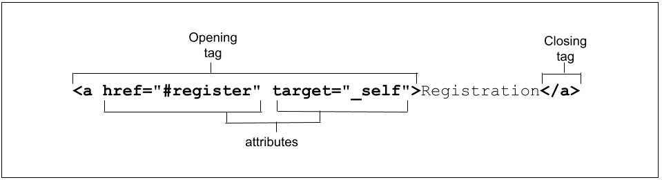

[PWA](https://habr.com/ru/post/418923/)

https://developer.mozilla.org/en-US/docs/Web/API/Fetch_API
fetch
The Fetch API provides an interface for fetching resources (including across the network). It will seem familiar to anyone who has used XMLHttpRequest, but the new API provides a more powerful and flexible feature set.

«AJAX» (аббревиатура от Asynchronous JavaScript And XML)

A Promise is an object representing the eventual completion or failure of an asynchronous operation.
Essentially, a promise is a returned object to which you attach callbacks, instead of passing callbacks into a function.

Guarantees

* Callbacks added with then() will never be invoked before the completion of the current run of the JavaScript event loop.
* These callbacks will be invoked even if they were added after the success or failure of the asynchronous operation that the promise represents.
* Multiple callbacks may be added by calling then() several times. They will be invoked one after another, in the order in which they were inserted.

Куки (cookies) — это хранящиеся на компьютерах и гаджетах небольшие файлы, c помощью которых сайт запоминает информацию о посещениях пользователя.

Сами по себе куки не опасны — это обычные текстовые файлы. Они не могут запускать какие-либо процессы на компьютере и каким-то образом влиять на работу операционной системы.

В то же время куки, в частности, умеют запоминать:

в какое время и с какого устройства человек заходил на страницу;
предпочтения пользователей (например, язык, валюта или размер шрифта);
товары, которые просматривались или добавлялись в корзину, даже если пользователь временно вышел из интернет-магазина;
текст, который мы вводили на сайте раньше;
IP-адрес и местоположение пользователя;
дату и время посещения сайта;
версию операционной системы и браузера;
клики и переходы.

HTML (HyperText Markup Language) is the backbone of the web, providing the content, as well as the structure of that content.
CSS provide the look and feel, or presentation level of the page.
JS is the behaviour level, often used to manipulate the objects within a document.

# HTML

## DOM
The Document Object Model (DOM) is an architecture that describes the structure of a document.

The DOM is the data representation of the structure and content of the HTML document.

A document, in turn, consists of a hierarchical tree of nodes.

As the browser parses HTML, it creates a JavaScript object for every element and section of text encountered. These objects are called nodes—element nodes and text nodes, respectively.

A node is a fundamental record representing a single object within the document. 

### DOM API
https://developer.mozilla.org/en-US/docs/Web/API/HTML_DOM_API

The HTML DOM API is made up of the interfaces that define the functionality of each of the elements in HTML

## Elements

HTML documents are basically a tree of nodes, including HTML elements (ELEMENT_NODE) and text nodes (TEXT_NODE). HTML elements provide the semantics and formatting for documents, including creating paragraphs, lists and tables, and embedding images and form controls. Each element may have multiple attributes specified.

Some nodes:
* ELEMENT_NODE = 1
* ATTRIBUTE_NODE 2 
* TEXT_NODE = 3
* CDATA_SECTION_NODE = 4
* COMMENT_NODE = 8
...

Web Developers basically work with HTML elements only.
HTML consists of a series of elements, which you use to enclose, or wrap, different parts of the content to make it appear or act in a certain way. HTML elements are delineated by tags, written using angle brackets (< and >).

Elements and tags aren't the exact same thing, though many people use the terms interchangeably. 
The tag includes tag name and the brackets, for example, `<h1>`. An "element" is the opening and closing tags, and all the content between those tags, including nested elements.

For some elements the closing tag is not mandatory. It's not the same as self-closing tags.
If closing tag is not mandatory it means the browser will close it by itself (probably not in the way you intended)

In some cases, browsers will include elements even if the tags aren't present in the markup. (`<body></body>`, `<tbody></tbody>`)

The default appearance of semantic elements is set by user-agent stylesheets.

The element you choose, and therefore the tags you use, should be appropriate for the content you are displaying, as tags have semantic meaning. 

The semantics, or role, of an element is important to assistive technologies and, in some cases, search engines.

### Non-replaced elements
Non-replaced elements have opening and (sometimes optional) closing tags that surround them and may include text and other tags as sub-elements. These enclosing tags can turn a phrase or image into a hyperlink, can make a sentence into a header, can give emphasis to words, and so on.

There is no object/widjet for non-replaced elements

### Replaced and void elements
Replaced elements are replaced by objects/widgets. Being replaced by objects, each comes with a default appearance.

Void elements are all self-closing elements and are represented by one tag. 

* `<meta />`
* `<link />`
* ``
* `<input />`
* ...

Most void elements are replaced; but again, not all, as we saw with `base`, `link`, `param`, and `meta`.

https://web.dev/learn/html/overview#attributes

## Attributes

HTML attributes provide additional information about HTML elements.

* All HTML elements can have attributes
* Attributes provide additional information about elements
* Attributes are always specified in the start tag
* Attributes usually come in name/value pairs like: `name="value"`

There are now three modes used by the layout engines in web browsers:
* quirks mode
* limited-quirks mode
* no-quirks mode (full standarts mode) uses `<!DOCTYPE html>` (it's doctype node)

## script defer vs script async

There are two attributes that can reduce the blocking nature of JavaScript download and execution: defer and async. With defer, HTML rendering is not blocked during the download, and the JavaScript only executes after the document has otherwise finished rendering. With async, rendering isn't blocked during the download either, but once the script has finished downloading, the rendering is paused while the JavaScript is executed.

# Content Security Policy
The web's security model is rooted in (based on) the same-origin policy (SOP). Under the policy, a web browser permits scripts contained in a first web page to access data in a second web page, but only if both web pages have the same origin. An origin is defined as a combination of URI scheme, host name, and port number. This policy prevents a malicious script on one page from obtaining access to sensitive data on another web page through that page's Document Object Model (DOM).

# Semantic
Semantic means "relating to meaning". Writing semantic HTML means using HTML elements to structure your content based on each element's meaning, not its appearance.

* There should be only one `<main>` per page.
* The `<aside>` is for content that is indirectly or tangentially related to the document's main content.
* An `<article>` represents a complete, or self-contained, section of content that is, in principle, independently reusable.

# CSS
Appearance is the realm of CSS

# English
the look and feel
interchangeably
but here we'll just discuss what they are in general

and for legibility, quotes and spaces are recommended, and appreciated.
browsers have a lot of latitude

assistive technologies

search engines

descendant nodes

 providing a means for grouping other nodes together

 so every element is also a node (but not the other way around)

 and so forth.

browser implements the specification in its own way
to the sighted visitor

site responsiveness
That may seem counterintuitive

case-insensitive

 to do so is poor usability and negatively impacts accessibility.
 Don't you hate it when 

 I think we have enough small talk, why are you here?
 
 will understand the outline of the document.

 To get the most out of this module,  it would be a good idea to 

 Basic computer literacy
 To gain familiarity with accessibility, including what it is

  they have a visual impairment

  "We are all different, but we are all human, and therefore have the same human rights."
  Attributes were briefly discussed in Overview of HTML; it's time for a deep dive.
  To make programming easier for your current and future self
Taking the time to understand namespaces now will save you from future headaches.

Contrary to popular opinion
If all the descendants of the root element
The class attribute takes as its value a

# Rules
* `<!DOCTYPE html>` is present
* `<html><head></head><body></body></html>` is present
* `lang` attribute for `html` element is defined
* `<meta charset="utf-8" />` is defined and it must be the first because it can effect other meta tags, the default charset is `windows-1252`
* `<title>` is present on each page with different content
    * don't include emojis in a title document because search engines can treat them as spam and don't display them in search results
    * you can use &nbsp; in title
* `<meta name="viewport" content="width=device-width" />` Viewport metadata is present
* `<link rel="stylesheet" href="styles.css">` is used
    * the `<link>` compared to `<style>` and the style attribute is preferred method of including stylesheets
* `<link rel="icon" ... />` is used for favicon across all the pages
    * `apple-touch-icon` is for iOS devices
    * `mask-icon` is for pinned tabs on macOS
* `<link rel="alternate" href="https://bla/fr/" hreflang="fr-FR" />` is used for alternate versions of the site
    * do I need other alternate meta tags? RSS, PDF, ...
* `<link rel="canonical" ... />` is used
* `<meta name="description" content="..." />` is present
* `<meta name="theme-color" />` it's better to use it even with PWA
* `<meta property="og:*" content="..." />` are defined https://ogp.me/
* consider putting some meta tags (`apple-mobile-web-app-capable`, `application-name`) into manifist for PWA
* check other meta elements https://developer.mozilla.org/en-US/docs/Web/HTML/Element/meta/name
* check if necessary links have `target` attribute
* all images have  alternative text 
* Is my date picker widget usable by people using screen readers?
* If content updates dynamically, do visually impaired people know about it?
* Are my UI buttons accessible to both keyboard and touch interface users?
* anchors are used in pages? `href="https://bla.com#ref"`
* remove comments from the pages because of perfomance and security (`<!-- -->`)
* check if there is no XSS atacks https://cheatsheetseries.owasp.org/cheatsheets/XSS_Filter_Evasion_Cheat_Sheet.html
* set CSP (content security policy) header https://web.dev/articles/csp to reduce XSS atacks
* values of attributes are enclosed by double quotes
* self-closing tags ends with `/>` but not `>` for better readability

# other
Syntax describes the rules by which words can be combined into sentences, while semantics describes what they mean.

# Accessibility
Accessibility (often abbreviated to A11y — as in, "a", then 11 characters, and then "y") in web development means enabling as many people as possible to use websites, even when those people's abilities are limited in some way.

We are all different, but we are all human, and therefore have the same human rights.

The key lesson here is to think beyond your own computer and how you use the web, and start learning about how others use it — you are not your users.

hearing impairment
visual impairments
mobility impairments
cognitive impairments

People with visual impairments include people with blindness, low-level vision, and color blindness.
screen magnifiers

accessibility object model (AOM)

# Attributes
Attributes are what make HTML so powerful. Attributes are space-separated names and name/value pairs appearing in the opening tag, providing information about and functionality for the element.

If a boolean attribute is present, it is always true. 
Boolean attributes include `autofocus`, `inert`, `checked`, `disabled`, `required`, `reversed`, `allowfullscreen`, `default`, `loop`, `autoplay`, `controls`, `muted`, `readonly`, `multiple`, and `selected`.
Note that in XML languages, like SVG, all attributes need to include a value, including boolean attributes.

there is no false value for boolean attribute, to make attribute false we just need to omit the attribute.

Another story with enumerated attributes. For example, `contenteditable` the values can be `"true"`, `"false"`, `"plaintext-only"`. If this attribute is missing or its value is invalid (emoji, wrong value or empty string), its value is inherited from its parent element: so the element is editable if its parent is editable.

There are about 30 global attributes https://developer.mozilla.org/en-US/docs/Web/HTML/Global_attributes#list_of_global_attributes

When a URL includes a hash mark (#) followed by a string of characters, that string is a fragment identifier. If that string matches an id of an element in the web page, the fragment is an anchor, or bookmark, to that element. The browser will scroll to the point where the anchor is defined.
The hash-mark separator in the href is not part of the fragment identifier. The fragment identifier is always the last part of the URL and is not sent to the server.

## tabindex

The tabindex attribute can be added to enable it to receive focus

## Custom attributes
They have to start with `data-`

# converntions

use kebab-case convention for values of `id`, `class`, `name` HTML attributes
use kebab-case convention for names of the files
use kebab-case convention for URLs

use snake_case for python code

use camelCase for js code

use PascalCase for class names in Python and JS

## ragment identifier
A fragment identifier is a short string of characters that refers to a resource that is subordinate to another, primary resource.  The syntax requires that the fragment identifier be separated from the rest of the URI reference by a number sign or hash character. The separator is not considered part of the fragment identifier.
Setting href="#", will scroll the user to the top of the page.

## form control
 form control is a user interface control that serves as the point of connection between the user and the server. Interactions vary by control type: buttons: button file handling: input type="file" menus: select, etc. And are also grouped into categories
Controls are essentially an API of key-value pairs for pinging back and forth to the server.

text fields, buttons, checkboxes, range controls, or color pickers are form controls

# ARIA
There are over 50 aria-* states and properties that can be used to ensure accessibility

# JS
docoment.getElementsBy... returns live node list
document.querySelectorAll returns static node list ( will not update if more elements are added to the node ) 